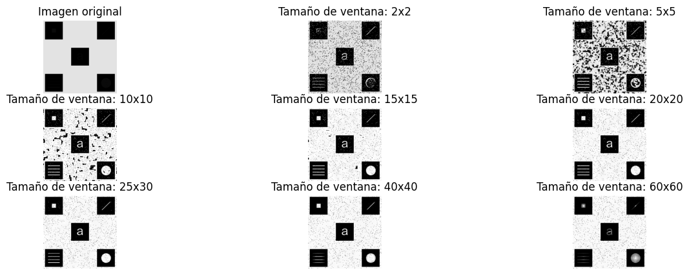
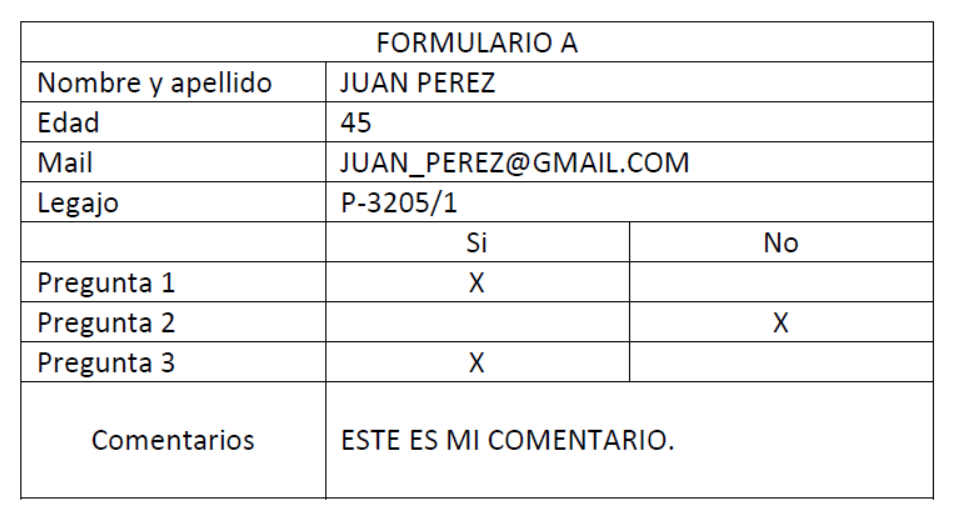
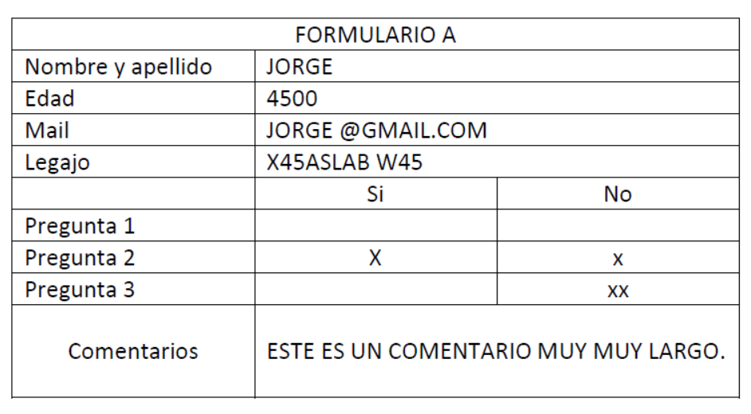

# Set Up

Con Python 3.11.0 o superior instalado, los siguientes son los pasos a seguir para acondicionar el proyecto.

## Instalar dependencias

Las dependencias precisadas para este proyecto se encuentran listadas en el archivo `requirements.txt`. Para instalarlas, asegurese de encontrarse en el entorno de trabajo y simplemente ejecute en la terminal:

`pip install -r requirements.txt`

Puedes chequear las dependencias instaladas y sus versiones usando el comando: `pip list`

## Run

Dentro del entorno de trabajo, ejecutar en la terminal `py ejercicio1.py` para ver los resultados del primer problema. Cerrar la imagen ploteada y luego ejecutar en la terminal `py ejercicio2.py` para conocer los resultados del segundo problema.


# Problemas tratados

---
### 1. Ecualización local del histograma sobre una imagen específica
---

**Resolución solicitada resumida:**

Desarrolle una función para implementar la ecualización local del histograma, que reciba como parámetros de entrada la imagen a procesar, y el tamaño de la ventana de procesamiento (M x N). Utilice dicha función para analizar la imagen que se muestra en Fig. 1 e informe cuales son los detalles escondidos en las diferentes zonas de la misma. Analice la influencia del tamaño de la ventana en los resultados obtenidos.

*Nota:* Para ampliar sobre la consigna del problema, dirigirse al archivo TUIA_PDI_TP1_2023.pdf en el presente proyecto

En nuestro código, la siguiente función detallada es la llamada para probar distintos tamaños de ventana y luego plotear los resultados en una única figura junto con la imagen original:

```python
def local_hist_eq(img, window_size=[3, 3]):
    """
    Aplica ecualización local del histograma a una imagen en escala de grises.

    :param img: Imagen en escala de grises representada como un arreglo numpy.
    :param window_size: Tamaño de la ventana para la ecualización local del histograma (por defecto, [3, 3]).
    :return: Imagen con ecualización local del histograma aplicada.
    """
    # Se valida que la imagen ingresada sea un arreglo numpy con forma (x, y)
    if not isinstance(img, np.ndarray) or img.ndim != 2:
        print(img.ndim)
        raise ValueError("La imagen debe ser un arreglo NumPy en escala de grises con forma (x, y).")

    # Se valida que el window_size ingresado sea una lista de la forma [a, b] donde a y b son números enteros
    if not isinstance(window_size, list) or len(window_size) != 2 or not all(isinstance(val, int) for val in window_size):
        raise ValueError("window_size debe ser una lista de dos números enteros [a, b].")

    # Se obtienen las dimensiones de la ventana y se comprueba que sean válidas
    window_width, window_height = window_size
    if window_width <= 1 or window_height <= 1 or window_width > img.shape[0] or window_height > img.shape[1]:
        raise ValueError("Los valores en window_size deben ser enteros mayores que 1 y menores que las dimensiones de la imagen.")

    # Se obtienen las dimensiones de la imagen ingresada
    height, width = img.shape

    # Se crea la imagen de salida inicialmente vacía del mismo tamaño que la imagen ingresada
    img_output = np.zeros((height, width), dtype=np.uint8)

    # Se calcula la mitad del ancho y alto de la ventana (vecindario) a utilizar para la ecualización local
    half_window_width = window_width // 2
    half_window_height = window_height // 2

    # Se crea un padding en la imagen original utilizando cv2.BORDER_REFLECT
    img_padded = cv2.copyMakeBorder(img, half_window_height, half_window_height, half_window_width, half_window_width, cv2.BORDER_REFLECT)

    # Bucle for para recorrer el alto de la imagen
    for y in range(height):
        # Bucle for para recorrer el ancho de la imagen
        for x in range(width):
            # 1) Se crea un recorte del tamaño de la ventana solicitada
            window = img_padded[y:y + window_height, x:x + window_width]

            # 2) Se aplica ecualización por el histograma (cv2.equalizeHist) a dicho recorte
            hist_eq_window = cv2.equalizeHist(window)

            # 3) Se obtiene el valor de intensidad del pixel central del recorte ecualizado
            central_pixel_value = hist_eq_window[half_window_height, half_window_width]

            # 4) Finalmente, se asigna ése valor en el pixel (y, x) de la imagen de salida "img_output"
            img_output[y, x] = central_pixel_value

    return img_output
```

<p align="center">
  
</p>

<p align="center" style="font-size: 12px;">Fig. 1.1 Se muestra la imagen original y los resultados de aplicar la ecualización local del histograma sobre la misma para distintos tamaños de ventana.</p>

Podemos ver la variabilidad de detalles resaltados de la imagen original para distintos tamaños de ventana.

*Nota:* Para una observación más precisa del resultado, dirigirse al archivo Img_original_e_imgs_de_salida_para_distintos_tamanos_de_ventana.pdf ubicado en el directorio files/results/ en el presente proyecto.

---
### 2. Validación de formulario
---
**Resolución solicitada resumida:**

Se tiene una serie de formularios completos, en formato de imagen, y se pretende validar cada uno de ellos, corroborando que cada uno de sus campos cumpla con las siguientes restricciones:
1. Nombre y apellido: Debe contener al menos 2 palabras y no más de 25 caracteres en total.
2. Edad: Debe contener 2 o 3 caracteres.
3. Mail: Debe contener 1 palabra y no más de 25 caracteres.
4. Legajo: 8 caracteres formando 1 sola palabra.
5. Preguntas: se debe marcar con 1 caracter una de las dos celdas SI y NO.
No pueden estar ambas vacías ni ambas completas.
6. Comentarios: No debe contener más de 25 caracteres.

Desarrolle un algoritmo para validar los campos del formulario. Debe tomar como entrada la imagen del mismo y mostrar por pantalla el estado de cada uno de sus campos. Por ejemplo:
>Nombre y apellido: OK
Edad: OK
Mail: MAL
Legajo: MAL
Pregunta 1: OK
Pregunta 2: MAL
Pregunta 3: OK
Comentarios: OK

Utilice el algoritmo desarrollado para evaluar las imágenes de formularios completos (archivos formulario_xx.png) e informe los resultados obtenidos.

*Nota:* Para ampliar sobre la consigna del problema, dirigirse al archivo TUIA_PDI_TP1_2023.pdf en el presente proyecto

En nuestro código, la siguiente función es la llamada para validar los formularios presentes en las imágenes, devolviendo un diccionario con los resultados correspondientes para cada campo:

```python
## Función completa
def img_to_validation(img):
    crop_dict = recorte_celdas_form(img)
    return eval_form(crop_dict)
```
*Nota:* Como se puede observar, la función principal hace uso de otras funciones. Las mismas se encuentran detalladas en el archivo ```python funciones.py``` en el presente proyecto.

<p align="center">
  
</p>

<p align="center" style="font-size: 12px;">Fig. 2.1 Se muestra la imagen de un formulario que cumple con los requisitos.</p>

Resultado de la validación para Fig. 2.1:
```python
{
    'Nombre y Apellido': 'OK', 
    'Edad': 'OK', 'Mail': 'OK', 
    'Legajo': 'OK', 
    'Pregunta 1': 'OK', 
    'Pregunta 2': 'OK', 
    'Pregunta 3': 'OK', 
    'Comentarios': 'OK'
}
```

<p align="center">
  
</p>

<p align="center" style="font-size: 12px;">Fig. 2.2 Se muestra la imagen de un formulario que no cumple con los requisitos.</p>

Resultado de la validación para Fig. 2.2:
```python
{
    'Nombre y Apellido': 'MAL', 
    'Edad': 'MAL', 
    'Mail': 'MAL', 
    'Legajo': 'MAL', 
    'Pregunta 1': 'MAL', 
    'Pregunta 2': 'MAL', 
    'Pregunta 3': 'MAL', 
    'Comentarios': 'MAL'
}
```

Podemos ver que para cada imagen ingresada devuelve información detallada sobre la validación de sus campos.

*Nota:* Para una observación completa de la lista de formularios, dirigirse al archivo resultados_validacion_formularios.pdf ubicado en el directorio files/results/ en el presente proyecto.
